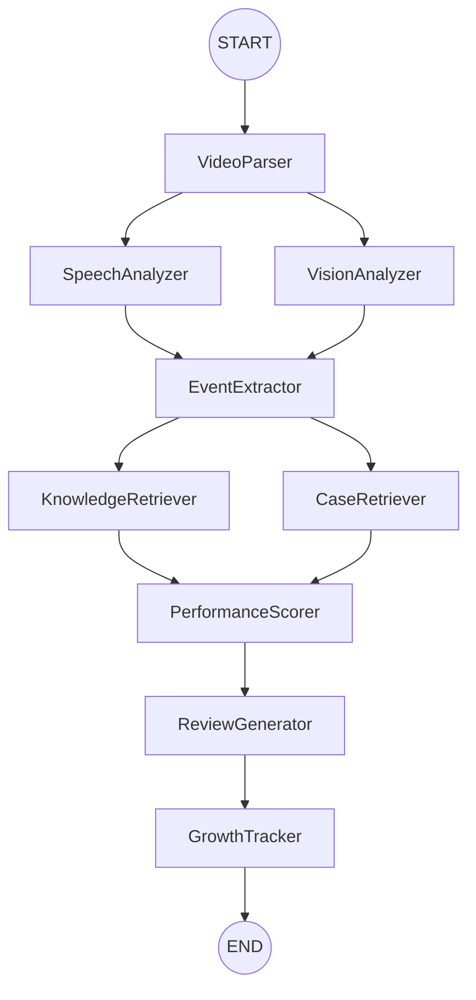

# ReplayMind

基于多模态AI与RAG的游戏录像智能复盘系统。

## 📋 项目概述

ReplayMind是一个智能游戏录像复盘系统，通过多模态AI技术（视频解析、语音识别、视觉理解）和RAG技术（知识库检索、案例库检索），为玩家提供专业的游戏复盘分析和个性化提升建议。

## 🏗️ 项目背景

### 为什么需要游戏复盘的重要性

在当今电子竞技产业快速发展，越来越多的玩家希望通过复盘提升游戏技术。传统的人工复盘存在以下局限性：

1. **时间成本高**：一场30分钟的比赛需要同样需要1-2小时的复盘
2. **主观性强**：个人容易忽略自己的问题
3. **专业性不足**：普通玩家缺乏职业选手的视角和经验
4. **效率低下**：反复观看录像效率不效率不高

### 多模态AI的机遇

近年来，多模态AI技术成熟，为智能游戏复盘提供了新可能：

- **Whisper** - 语音识别转写**可以自动语音识别
- **大语言模型视觉** - 语言识别的视觉理解能力大幅提升
- **RAG技术** - 检索增强生成提供了精准的专业知识

## 🎯 项目简介

### 核心理念

ReplayMind 旨在将AI技术赋能游戏玩家，实现：

1. **自动化分析** - 无需手动标注
2. **专业化分析** - 基于专家视角
3. **个性化建议** - 针对玩家特点
4. **可追溯** - 持续追踪提升

### 解决的问题

- ❌ 找不到游戏录像中哪个操作错了？
- ❌ 关键时刻的决策应该怎么改？
- ❌ 我需要看了很多遍却没找到重点？
- ✅ AI自动分析，生成专业的复盘报告

## 🏛️ 系统架构

### 技术栈

#### 前端
- **框架**: Next.js 14 (App Router)
- **语言**: TypeScript 5
- **样式**: TailwindCSS 4
- **组件库**: shadcn/ui
- **状态管理**: Zustand
- **数据请求**: TanStack Query

#### 后端
- **框架**: FastAPI
- **语言**: Python 3.11+
- **ORM**: SQLAlchemy 2.0
- **数据库迁移**: Alembic

#### AI/ML
- **工作流编排**: LangGraph
- **语音识别**: Whisper
- **视觉理解**: Qwen2.5-VL-7B (Ollama)
- **Embedding**: BGE-M3
- **Reranker**: BGE-Reranker

#### 数据存储
- **关系型数据库**: PostgreSQL 15
- **向量数据库**: Milvus 2.3+
- **对象存储**: MinIO
- **缓存/消息队列**: Redis 7

### 架构设计理念

采用 DDD（领域驱动设计）
1. **Common First** - 统一基础设施层，统一接口
2. **Clear Separation of Concerns**
3. **异步架构** - 支持高并发
4. **可扩展性** - 微服务拆分
5. **可观测性** - 完整的日志和监控

### 详细技术选型

| 技术 | 选择原因 |
| --- | --- |
| LangGraph | 支持复杂的多步骤工作流，状态管理 |
| FastAPI | 高性能、类型安全、自动文档 |
| PostgreSQL | 关系型数据库，支持事务 |
| Milvus | 专业的向量数据库，支持大规模向量检索 |
| BGE-M3 | 中文、英文支持多种embedding |
| Whisper | 开源语音识别 |
| Qwen2.5-VL | 开源的视觉大模型 |

## 🛠️ 实现细节

### 1. Common 基础设施层

#### 路径管理 - [path_utils.py](file:///d:/pycharm/daima/ReplayMind/backend/common/path_utils.py)

智能查找项目根目录，提供路径拼接方法，确保代码在任何环境下都能找到正确的路径。

```python
PathUtils.get_project_root()  # 自动查找项目根
PathUtils.join("data", "videos")  # 路径拼接
```

#### 配置管理 - [config.py](file:///d:/pycharm/daima/ReplayMind/backend/common/config.py)

采用 Pydantic Settings，支持从 `.env` 文件，提供类型安全的配置管理。

```python
class Settings(BaseSettings):
    APP_NAME: str = "ReplayMind"
    DATABASE_URL: str = "..."
```

#### 日志系统 - [logger.py](file:///d:/pycharm/daima/ReplayMind/backend/common/logger.py)

支持控制台和文件双输出，自动日志轮转，便于调试和生产环境。

#### LLM 工具 - [llm.py](file:///d:/pycharm/daima/ReplayMind/backend/common/llm.py)

封装了 Ollama 模型，提供聊天和视觉模型的统一接口。

### 2. Domain 领域层

#### 领域模型 - [domain/models/](file:///d:/pycharm/daima/ReplayMind/backend/domain/models/)

基于 SQLAlchemy 2.0，完整的模型，支持异步操作。

```python
# 用户模型
class User(Base):
    id: uuid.UUID
    username: str
    # ...

# 视频模型
class Video(Base):
    id: uuid.UUID
    status: VideoStatus  # 枚举类型
```

#### 仓储模式 - [domain/repositories/](file:///d:/pycharm/daima/ReplayMind/backend/domain/repositories/)

提供了基础仓储和专门仓储，实现了完整的 CRUD 操作。

```python
class BaseRepository(Generic[ModelType]):
    async def get(self, id: uuid.UUID):
        pass
```

### 3. Infrastructure 基础设施层

#### 数据库客户端

- **PostgreSQL** - 关系数据存储
- **Redis** - 缓存和任务队列
- **Milvus** - 向量检索

```python
# PostgreSQL 异步连接池
async def get_db():
    async with async_session_maker() as session:
        yield session

# Redis 客户端
redis = Redis(connection_pool=redis_pool)
```

#### AI 客户端封装

每个 AI 服务都有独立的客户端，统一的接口，便于扩展。

```python
# Whisper 语音识别
whisper_client.transcribe(audio_path)

# Qwen2.5-VL 视觉分析
qwen_vl_client.analyze_image(image_path)
```

### 4. LangGraph 工作流

#### State 设计 - [langgraph_workflow/state.py](file:///d:/pycharm/daima/ReplayMind/backend/langgraph_workflow/state.py)

完整的状态，涵盖了所有阶段的数据。

```python
class ReplayMindState(TypedDict):
    video_id: str
    frames: List[Dict[str, Any]]
    transcripts: List[Dict[str, Any]]
    events: List[GameEvent]
    scores: Optional[ScoreResult]
    report_content: Optional[str]
    # ...
```

#### 工作流节点 - [langgraph_workflow/nodes/](file:///d:/pycharm/daima/ReplayMind/backend/langgraph_workflow/nodes/)

实现了工作流的 9 个节点：

1. **VideoParser** - 视频解析
2. **SpeechAnalyzer** - 语音分析
3. **VisionAnalyzer** - 视觉分析
4. **EventExtractor** - 事件抽取
5. **KnowledgeRetriever** - 知识库检索
6. **CaseRetriever** - 案例库检索
7. **PerformanceScorer** - 性能评分
8. **ReviewGenerator** - 报告生成
9. **GrowthTracker** - 成长跟踪

#### 工作流组装 - [langgraph_workflow/graph.py](file:///d:/pycharm/daima/ReplayMind/backend/langgraph_workflow/graph.py)

使用 LangGraph 组装工作流，支持状态和检查点。

```python
workflow.add_node("video_parser", video_parser_node.execute)
workflow.add_edge("video_parser", "speech_analyzer")
workflow.add_edge("video_parser", "vision_analyzer")
# ...
```

### 5. API 层

#### RESTful API - [api/v1/](file:///d:/pycharm/daima/ReplayMind/backend/api/v1/)

完整的视频、报告、成长、任务 API，使用 Pydantic 进行数据验证。

### 6. 前端实现

#### Next.js 14 App Router

```tsx
export default function DashboardPage() {
    return (
        <div className="container mx-auto">
            {/* 仪表盘内容 */}
        </div>
    );
}
```

#### API 客户端 - [lib/api.ts](file:///d:/pycharm/daima/ReplayMind/frontend/lib/api.ts)

封装了所有 API 调用，使用 Axios。

#### 状态管理 - [lib/store.ts](file:///d:/pycharm/daima/ReplayMind/frontend/lib/store.ts)

使用 Zustand 进行状态管理。

## � LangGraph 工作流



## �📁 项目结构

```
ReplayMind/
├── backend/                            # FastAPI 后端
│   ├── common/                        # 通用工具
│   │   ├── __init__.py
│   │   ├── path_utils.py             # 路径工具
│   │   ├── config.py                  # 配置管理
│   │   ├── logger.py                  # 日志工具
│   │   └── llm.py                     # LLM 工具
│   │
│   ├── domain/                        # 领域层 (DDD)
│   │   ├── models/                    # 领域模型
│   │   │   ├── user.py
│   │   │   ├── video.py
│   │   │   ├── report.py
│   │   │   └── growth.py
│   │   │
│   │   └── repositories/             # 仓储
│   │       ├── base.py
│   │       ├── user_repo.py
│   │       ├── video_repo.py
│   │       └── report_repo.py
│   │
│   ├── infrastructure/               # 基础设施层
│   │   ├── db/                        # 数据库客户端
│   │   │   ├── postgres.py
│   │   │   ├── redis.py
│   │   │   └── milvus.py
│   │   │
│   │   ├── storage/                   # 存储客户端
│   │   │   └── minio_client.py
│   │   │
│   │   └── ai/                        # AI 客户端
│   │       ├── whisper_client.py
│   │       ├── qwen_vl_client.py
│   │       ├── bge_embedding.py
│   │       └── bge_reranker.py
│   │
│   ├── api/                           # API 层
│   │   └── v1/
│   │       ├── videos.py
│   │       ├── reports.py
│   │       ├── growth.py
│   │       └── tasks.py
│   │
│   ├── langgraph_workflow/           # LangGraph 工作流
│   │   ├── state.py                  # State 定义
│   │   ├── graph.py                  # 工作流图
│   │   └── nodes/                    # 节点
│   │       ├── video_parser_node.py
│   │       ├── speech_analyzer_node.py
│   │       ├── vision_analyzer_node.py
│   │       ├── event_extractor_node.py
│   │       ├── knowledge_retriever_node.py
│   │       ├── case_retriever_node.py
│   │       ├── performance_scorer_node.py
│   │       ├── review_generator_node.py
│   │       └── growth_tracker_node.py
│   │
│   ├── main.py                       # FastAPI 主入口
│   ├── requirements.txt
│   └── Dockerfile
│
├── frontend/                          # Next.js 前端
│   ├── app/                          # Next.js App Router
│   │   ├── layout.tsx
│   │   ├── page.tsx
│   │   ├── globals.css
│   │   └── dashboard/
│   ├── components/
│   ├── lib/
│   │   ├── api.ts
│   │   ├── store.ts
│   │   └── utils.ts
│   ├── package.json
│   └── Dockerfile
│
├── docker/                           # Docker 配置
│   ├── nginx/
│   │   └── nginx.conf
│   └── scripts/
│       └── init-db.sh
│
├── .env.example
├── .gitignore
└── README.md
```

## 🚀 快速开始

### 环境要求

- Docker & Docker Compose
- Git
- Node.js 18+
- Python 3.11+
- GPU (推荐用于 AI 模型推理)

### 安装步骤

1. **克隆项目**
```bash
git clone https://github.com/your-repo/ReplayMind.git
cd ReplayMind
```

2. **配置环境变量**
```bash
cp .env.example .env
# 编辑 .env 文件，修改配置
```

3. **启动服务**
```bash
docker-compose up -d
```

4. **访问应用**
- 前端: http://localhost:3000
- API 文档: http://localhost:8000/docs
- MinIO Console: http://localhost:9001

## 📡 API 文档

### 视频管理

```
POST   /api/v1/videos                    上传视频
GET    /api/v1/videos                    获取视频列表
GET    /api/v1/videos/{id}               获取视频详情
DELETE /api/v1/videos/{id}               删除视频
```

### 复盘报告

```
GET    /api/v1/reports                   获取报告列表
GET    /api/v1/reports/{id}              获取报告详情
GET    /api/v1/reports/{id}/content       获取报告内容
```

### 成长中心

```
GET    /api/v1/growth/overview            获取成长概览
GET    /api/v1/growth/trends             获取成长趋势
GET    /api/v1/growth/radar              获取能力雷达图
```

### 任务管理

```
GET    /api/v1/tasks/{id}                获取任务状态
GET    /api/v1/tasks/{id}/logs           获取任务日志
POST   /api/v1/tasks/{id}/cancel         取消任务
```

## 🔧 开发

### 后端开发

```bash
cd backend

# 创建虚拟环境
python -m venv venv
source venv/bin/activate  # Linux/Mac
# or
.\venv\Scripts\activate   # Windows

# 安装依赖
pip install -r requirements.txt

# 启动开发服务器
uvicorn main:app --reload
```

### 前端开发

```bash
cd frontend

# 安装依赖
npm install

# 启动开发服务器
npm run dev
```

## 📊 LangGraph 工作流


## 📈 数据库模型

### 核心表

- **users** - 用户表
- **videos** - 视频表
- **video_frames** - 视频帧表
- **audio_transcripts** - 音频转录表
- **game_events** - 游戏事件表
- **reports** - 复盘报告表
- **scores** - 评分表
- **recommendations** - 建议表
- **growth_records** - 成长记录表

## 🔍 Milvus Collections

### knowledge_base
- 知识库向量存储
- 支持 Hybrid Search (BM25 + Dense Retrieval)

### case_base
- 案例库向量存储
- 支持相似案例检索

## 🎯 实现过程中的经验总结

### 遇到的困难

1. **LangGraph 学习曲线陡峭
- 问题：LangGraph 的概念和实践有一定难度
- 解决：先设计 State，再逐步组装

2. **多模型整合挑战
- 问题：多种 AI 模型接口不同，API 差异大
- 解决：封装统一的接口，抽象底层

3. **异步架构复杂
- 问题：多个异步服务的协调
- 解决：使用 LangGraph 的内置状态管理

4. **向量数据库配置
- 问题：Milvus 的概念和索引类型多样
- 解决：先做 POC 验证，选择适合的索引

5. **前端/后端通信
- 问题：API 设计和状态同步
- 解决：采用 RESTful + 消息队列

### 收获

1. **DDD 设计模式实践
- 清晰的分层
- 更好的代码可维护性
- 领域逻辑和基础设施分离

2. **多模态 AI
- 掌握了 Whisper、Qwen2.5-VL 等多模态模型
- 掌握了 RAG 的检索增强生成
- 向量数据库的使用

3. **LangGraph 工作流
- 复杂 AI 工作流
- 状态管理和检查点

4. **异步编程
- 全面的异步架构
- 高并发处理

5. **全栈开发
- 前端 Next.js 14
- 后端 FastAPI
- Docker 部署

## 💡 优化建议

### 短期优化

1. **单元测试
- 添加单元测试覆盖率
- 添加集成测试

2. **性能优化
- 视频处理分布式调度（Celery/Kubernetes
- AI 模型推理优化（TensorRT/ONNX）
- 向量检索优化（分区、索引优化）

3. **用户体验
- 实时进度反馈
- 更友好的错误提示
- 报告 PDF 导出

### 中期优化

1. **多游戏支持
- 支持更多游戏类型
- 游戏特定优化
- 插件化架构

2. **社区功能
- 报告分享
- 多人协作复盘
- AI 教练对话

3. **实时直播分析
- 直播流实时分析
- 实时反馈和建议

### 长期优化

1. **多语言支持
- 多语言界面
- 多语言语音识别
- 多语言报告生成

2. **个性化模型
- 基于用户数据
- 个性化模型调优
- 持续学习

3. **企业级功能
- 团队协作
- SSO 认证
- 权限管理

4. **边缘计算
- 本地离线
- 减少延迟
- 更好的用户体验

## 📝 许可证

MIT License

## 🤝 贡献

欢迎提交 Issue 和 Pull Request！
